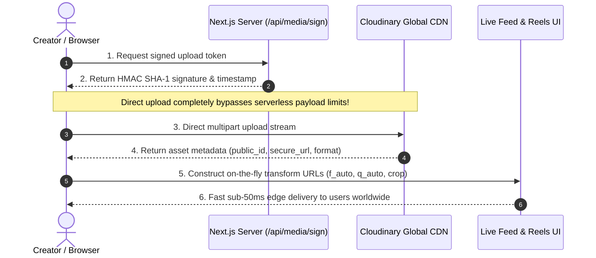

<div align="center">

# 🐝 MediaGram (BeeSocial)

### Next-Generation Social Media & Short-Form Video Platform  
**Powered End-to-End by Cloudinary**

[](https://mediagram-4lpf.vercel.app/)
[](https://nextjs.org/)
[](https://react.dev/)
[](https://cloudinary.com/)
[](https://www.typescriptlang.org/)
[](https://mediagram-4lpf.vercel.app/)

<br />

# 🚀 [OPEN LIVE APP: mediagram-4lpf.vercel.app](https://mediagram-4lpf.vercel.app/) 🚀

[](https://mediagram-4lpf.vercel.app/)
[](https://mediagram-4lpf.vercel.app/)

<br />

</div>

---

> [!IMPORTANT]
> ## 🌟 **Experience the Live Web Application**
> ### 👉 **Direct Link:** [**https://mediagram-4lpf.vercel.app**](https://mediagram-4lpf.vercel.app/) 👈
>
> *No configuration required! Fully deployed on Vercel's global edge network.*  
> *Test **1,000+ mock creator profiles**, **33 HD Cloudinary vertical reels**, **4-tone AI captions**, and **direct signed CDN media uploads** live.*

---

## 💡 Overview

**MediaGram** is a modern, high-performance social platform and short-form video feed built to showcase the full power of the [**Cloudinary Media Cloud**](https://cloudinary.com/). 

Rather than using Cloudinary as passive storage, MediaGram elevates it into the **central intelligence and delivery backbone** of the application — handling signed direct client-to-CDN ingestion, real-time dynamic responsive transformations, video poster extraction, automated AI captioning, and multi-tenant media management.

---

## 🎯 Problems Solved with Cloudinary

| Challenge | MediaGram + Cloudinary Solution | Impact |
|---|---|---|
| **Mobile Payload Bloat** | Automatic next-gen format negotiation (`f_auto`) and perceptual compression (`q_auto`). | **Up to 64.5% payload reduction** with zero visual degradation. |
| **Multi-Viewport Fragmentation** | On-the-fly URL transformations (`c_fill,g_auto`, `c_thumb,g_face`) from a single master asset. | One uploaded file dynamically powers feeds, 9:16 reels, story banners, and circular avatars. |
| **Serverless Upload Limits** | Cryptographic HMAC signed client-to-CDN direct streaming. | **Bypasses Vercel's 4.5 MB request limit**, allowing smooth 4K and large video uploads. |
| **Creator Cognitive Fatigue** | Cloudinary Vision & Semantic Context Engine ([`src/lib/cloudinary-ai.ts`](src/lib/cloudinary-ai.ts)). | Instant 4-tone AI captions (Cinematic, Viral, Aesthetic, Humor), auto-tags, and audio vibe pairing. |
| **Media Observability Blind Spot** | Live [Developer API Hub](https://mediagram-4lpf.vercel.app/library) and [Admin Command Center](https://mediagram-4lpf.vercel.app/admin). | Real-time visibility into CDN flags, compression ratios, and bandwidth savings. |

---

## ✨ Core Features

- 🎬 **[Vertical 9:16 Reels Engine](https://mediagram-4lpf.vercel.app/reels)** • [View Source](src/app/reels/page.tsx)
  - Native 9:16 snap-to-scroll video player with double-tap heart gesture.
  - Global [`VideoCoordinator`](src/lib/video-coordinator.ts) singleton guarantees strictly **one** unmuted video plays across all feeds, preventing overlapping audio.
  - Desktop keyboard controls (Arrow keys up/down, `M` to mute).

- 📱 **[Dynamic Home Feed & Ephemeral Stories](https://mediagram-4lpf.vercel.app/)** • [View Source](src/app/page.tsx)
  - Multi-factor discovery algorithm (User Interest, Engagement, Recency, Media Type).
  - Infinite feed stream with dynamic Fisher-Yates reshuffling.
  - 24-hour animated story carousel with interactive timed full-screen viewer.

- 🤖 **[AI-Powered Creator Studio](https://mediagram-4lpf.vercel.app/)** • [View Source](src/components/upload/CreatePostModal.tsx)
  - Direct signed drag-and-drop media upload via [`/api/media/sign`](src/app/api/media/sign/route.ts).
  - 33+ curated HD video reel presets ready for instant testing ([`src/lib/video-library.ts`](src/lib/video-library.ts)).
  - Cloudinary AI caption generator with 4 creator tones and smart hashtag recommendations.

- 🔍 **[Universal Explore & Discovery Grid](https://mediagram-4lpf.vercel.app/explore)** • [View Source](src/app/explore/page.tsx)
  - Masonry grid layout with real-time search across creators, hashtags, locations, and captions.

- 🗄️ **[Cloudinary Developer API Hub](https://mediagram-4lpf.vercel.app/library)** • [View Source](src/app/library/page.tsx)
  - Live asset inspector displaying applied transformation parameters, public IDs, and byte savings.
  - Real-time controls to inspect delivery URLs, formats, and CDN parameters.

- 📊 **[Admin Command Center & Observability](https://mediagram-4lpf.vercel.app/admin)** • [View Source](src/app/admin/page.tsx)
  - Real-time analytics panel tracking bandwidth savings (**14.2+ GB saved**) and CDN cache performance.

---

## ⚡ How Cloudinary Powers MediaGram



### Key Cloudinary Transformations Used

```
Master Asset (Image or 4K Video)
   │
   ├──► Feed Viewport       ──► c_fill,w_1080,q_auto,f_auto      (Optimized WebP/AVIF)
   ├──► Reels (9:16)        ──► q_auto,f_auto,vc_h264            (Adaptive mobile stream)
   ├──► Video Poster        ──► so_0,w_720,c_fill,f_jpg,q_auto   (Instant first-frame preview)
   └──► Profile Avatar      ──► c_fill,g_face,w_300,h_300,r_max  (Face-centered circular crop)
```

- **User Media Compartmentalization:** Media is partitioned into user-isolated folders:  
  `mediagram/users/{userId}/{posts|reels|stories|profile}` for secure multi-tenancy and clean asset lifecycle management.

---

## 🛠️ Tech Stack

- **Framework:** [Next.js 16](https://nextjs.org/) (App Router, Turbopack) & [React 19](https://react.dev/)
- **Media Engine:** [Cloudinary Node.js SDK v2](https://cloudinary.com/) & Direct CDN Ingestion API
- **Language:** [TypeScript 5](https://www.typescriptlang.org/)
- **Styling:** [Tailwind CSS v4](https://tailwindcss.com/) & Vanilla CSS (Studio cyber-glassmorphism theme)
- **Icons & Motion:** [Lucide Icons](https://lucide.dev/) & [Framer Motion](https://motion.dev/)
- **State Management:** Reactive Store with zero-latency local persistence (preloaded with 1,000+ mock users and 33 HD reel presets)
- **Deployment:** [Vercel](https://vercel.com/)

---

## 🚀 Getting Started

### 1. Clone the Repository
```bash
git clone https://github.com/gagankalyan39/mediagram.git
cd mediagram
```

### 2. Install Dependencies
```bash
npm install
```

### 3. Configure Environment Variables
Create a `.env.local` file in the project root:
```env
NEXT_PUBLIC_CLOUDINARY_CLOUD_NAME=your_cloud_name
CLOUDINARY_API_KEY=your_api_key
CLOUDINARY_API_SECRET=your_api_secret
```

> **Note:** Obtain credentials from the [Cloudinary Console](https://cloudinary.com/console). The application includes pre-loaded demo reels and mock accounts, so it runs completely out-of-the-box even before adding credentials!

### 4. Run the Development Server
```bash
npm run dev
```
Open **[http://localhost:3000](http://localhost:3000)** in your browser.

---

## 📁 Project Structure

```text
mediagram/
├── src/
│   ├── app/
│   │   ├── page.tsx                # Dynamic Home Feed & Stories
│   │   ├── reels/page.tsx          # Full-screen 9:16 vertical Reels engine
│   │   ├── explore/page.tsx        # Discovery masonry grid & search
│   │   ├── library/page.tsx        # Cloudinary Developer API Hub
│   │   ├── admin/page.tsx          # Bandwidth savings & metrics center
│   │   ├── profile/[username]/     # User profile & media tabs
│   │   └── api/media/sign/         # HMAC signature generation for uploads
│   ├── components/
│   │   ├── feed/                   # PostCard, StoriesBar, StoryViewer
│   │   ├── reels/                  # ReelsFeed vertical video component
│   │   ├── upload/                 # CreatePostModal with AI assistant
│   │   └── library/                # AssetInspector & transformation testbed
│   └── lib/
│       ├── cloudinary.ts           # Dynamic client transformation helpers
│       ├── cloudinary-server.ts    # Cloudinary Node.js SDK server wrapper
│       ├── cloudinary-ai.ts        # Multimodal AI caption & context engine
│       ├── video-coordinator.ts    # Singleton audio/video playback coordinator
│       └── video-library.ts        # 33 curated Cloudinary HD video reels
├── CLOUDINARY_HACKATHON_REPORT.md  # Detailed architecture & hackathon report
└── README.md                       # Project documentation
```

---

<div align="center">

### 🚀 Ready to explore?
# **[▶ Launch MediaGram Live Application](https://mediagram-4lpf.vercel.app/)**

[🚀 **Live Demo**](https://mediagram-4lpf.vercel.app/) • [📋 **Architecture Report**](CLOUDINARY_HACKATHON_REPORT.md) • [💻 **GitHub Repository**](https://github.com/gagankalyan39/mediagram)

</div>
